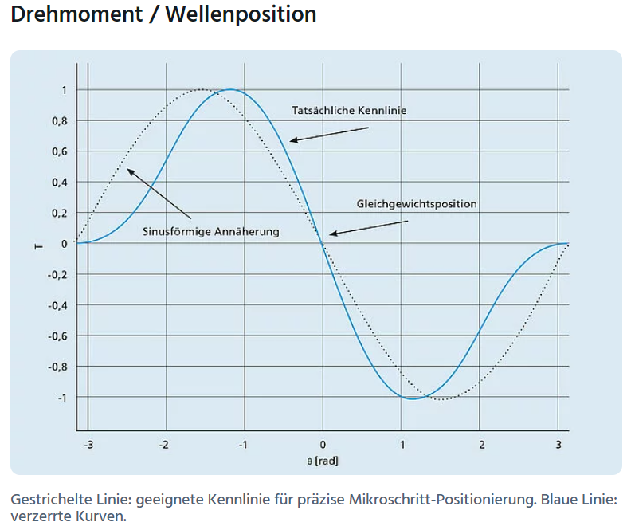

# Stepper motor Auswahl

## Quellen:
[stepper motor and driver plus arduino guide [0]](https://howtomechatronics.com/tutorials/arduino/stepper-motors-and-arduino-the-ultimate-guide/)

[stepper motor guide [1]](https://www.precifast.de/schrittmotor-auslegung-und-auswahl/)

[Stepperdriver guide [2]](https://www.precifast.de/schrittmotorsteuerung-eigenbau/)

[Stepperdriver guide [3]](https://leadingedgeindustrial.com/stepper-motor-drivers-step-guide/)

[ST-Microelectronics Stepper Motor Driving [4]](http://users.ece.utexas.edu/~valvano/Datasheets/Stepper_ST.pdf)

[Stepper Drehmoment [5]](https://www.faulhaber.com/de/know-how/tutorials/schrittmotoren-tutorial-fakten-und-mythen-zum-mikroschrittbetrieb/?gclid=CjwKCAjwjMiiBhA4EiwAZe6jQ3GSjoTto7YyuFtEhy8_d7abQlY-eyBkZPU3vqFnK36cBi9Z5TGmohoC2rkQAvD_BwE)
## Ergebnisse
Stepper Motor (SM); Stepper Driver (SD)

### Bauform (SM)
Laut **[1]** wird Hybrid SM am besten sein, da die am häufigsten sind. Hybrid ist Mischung aus Reluktanz- und Permanentmagnetmotor und hat für gewöhnlich ca. 200 steps/U aka Schrittwinkel 1.8°.

### Positions und Drehwinkelmessung (SM/SD)
Für Regelung evtl. benötigt kann aber sein, dass das von SD übernommen wird.

Kann auch rein durch Referenzschalter gelöst werden und dann rein Steuerungstechnisch die Schritte vorgegeben werden.

### Drehmomentverhalten (SM)
Laut **[5]** ist bei Mikroschrittbetrieb das Drehmoment erstens nicht mehr Sinusförmig sondern verzerrt(siehe Foto) und das inkrementalmoment nimmt drastisch ab siehe Formeln.

$$M_{INC} = M_{HFS} * sin(\frac{90°}{\mu_{PFS}})$$
$$M_N = M_{HFS} * sin(\frac{90° * N}{\mu_{PFS}})$$

$\mu_{PFS}$ = Anzahl Mikrosschritte pro Vollschritt\
$N$ = Anzahl erfolgter Mikroschritte [Ganzzahl] $N$ Kleiner oder gleich $\mu_{PFS}$\
$M_{HFS}$ = Haltemoment Vollschritt [Nm]\
$M_{INC}$ = Inkrementalmoment pro Mikroschritt [Nm]\
$M_N$ = Inkrementalmoment für $N$ Mikroschritte [Nm] $N$ Kleiner oder gleich $\mu_{PFS}$\
### Parameter (Schnittstelle)(SM)
- Drehmoment (mechanisch)
- Halte-/Stillstandsmoment (mechanisch)
- mechanischer Anschluss NEMA am wahrscheinlichsten (mechanisch)
- Anschlussausführung (SD)
    - keine Mittelanzapfung
    - Mittelanzapfung
    - gemeinsame Mittelanzapfung
    - Uni-/Bipolar (4/6,8 Anschlüsse)
- Spulenwiderstand/-induktivität (SD)
- maximaler Strangstrom (SD)

### Stepper Motor vergleich (SM)
|Ser.No.|Price € Amazon|µSteping   |V~supp~|I~rat~ |extra Features |
|-------|-------|-----------|-------|-------|---------------|
|A4988  |1,5 - 3|    1/16   | 8-35V |  1A   |       -       |
|DRV8825| 3 - 7 |    1/32   |8.2-45V| 1.5A  |       -       |
|TMC2208| 5 - 17|    1/16   | 5-36V | 1.2A  |interpol (1/256); UART interface|

### Stepper Driver vergleich (SD)
|Ser.No.|Price € Amazon|µSteping   |V~supp~|I~rat~ |extra Features |
|-------|-------|-----------|-------|-------|---------------|
|A4988  |1,5 - 3|    1/16   | 8-35V |  1A   |       -       |
|DRV8825| 3 - 7 |    1/32   |8.2-45V| 1.5A  |       -       |
|TMC2208| 5 - 17|    1/16   | 5-36V | 1.2A  |interpol (1/256); UART interface|

### Stepper steuerungsvarianten (SD)
- **SM + SD + Arduino:**\
    2-3 Motoren benötigen 4-6 Pins am arduino (noch mehr pins wenn teilschritt umschalten möglich sein soll).\
    Arduino pins geben Step-Clock als Rechtecksignal und Richtungs Flag aus.
    - **Code from scratch:**\
        Motordrehzahl durch Arduino speed begrenzt mit maximaler Steppfrequenz laut **[0]** mit einem Stepper motor von 1/600 µs -> 8.33 U/s bzw. 500 U/min. Für zwei oder drei Stepper schwer zu ermitteln aber sicher weniger als halbe Frequenz.
        *Sehr aufwendiger Steuerungscode!!*
    - **AccelStepper Library:** [[1](https://www.airspayce.com/mikem/arduino/AccelStepper/),[2](https://hackaday.io/project/183279-accelstepper-the-missing-manual/details)]\
        Motordrehzahl durch Library begrenzt mit max Steppfrequenz von 1000/s -> 5 U/s -> 300 U/min. Dieses Limit bleibt aber auch für mehrere Stepper erhalten und sinkt nicht.\
        Mit der Lib sollten 3 stepper kein Problem sein.\
        *Mittelmäßig aufwendiger Steuerungscode*
- **SM + SD + CNC-Shield + Arduino**

### Diskussion
Drehmoment und Haltemoment für unsere Anwendung wahrscheinlich nicht so wichtig, bissl Antriebsanalyse aber notwendig.
